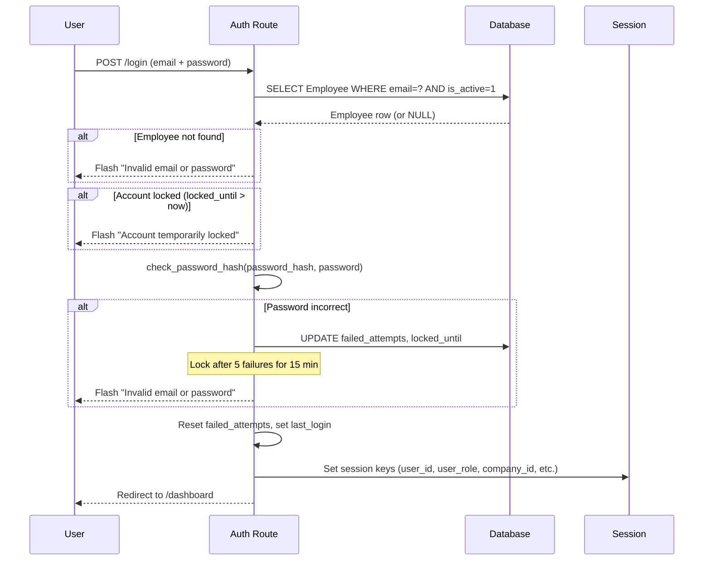
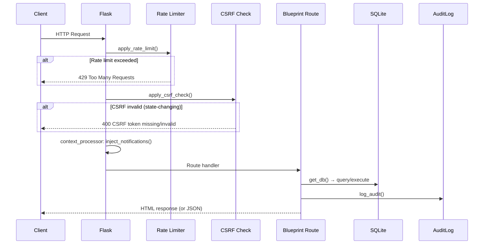
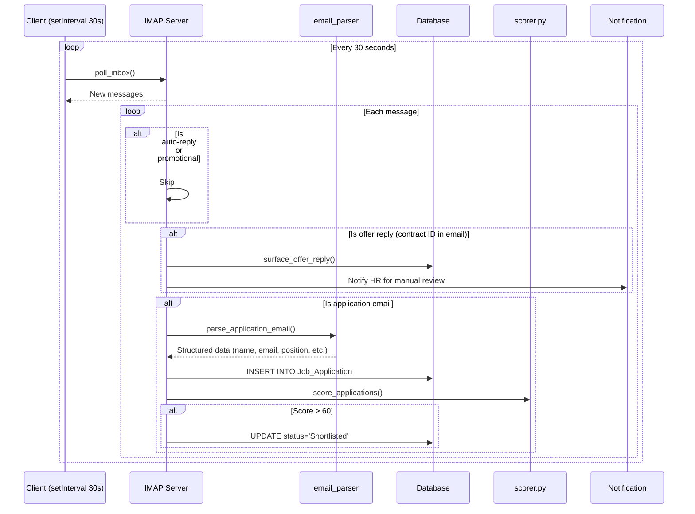

# SmartHR Architecture

> **Version**: V14.5 · **Last updated**: 2026-08-13
> This document is the single source of truth for SmartHR's architecture.
> Treat confirmed content as mandatory project context. Do not rewrite
> existing working code because another implementation looks cleaner.

---

## 1. System Overview

SmartHR is an internal **AI-powered HR management platform** for Malaysian enterprises.
It is a monolithic Flask application with a SQLite database, session-based
authentication, and vanilla CSS/JS front-end. The system covers the full
employee lifecycle: recruitment, onboarding, attendance (face recognition),
leave, payroll (Malaysian statutory deductions), invoice/claims, performance
reviews, year-end compensation, notifications, and audit logging.

### Key Characteristics

| Property | Value |
|---|---|
| Architecture style | Monolithic, server-rendered (MVC) |
| Database | SQLite (`instance/smarthr.db`), 39 tables |
| Auth model | Session-based, decorator RBAC |
| Front-end | Vanilla CSS/JS, Jinja2 server rendering |
| Multi-tenancy | Company-scoped (branch hierarchy within a company) |
| Background jobs | Payroll scheduler (daemon thread), IMAP email poller (client-side JS) |

**Implemented now**.

---

## 2. Technology Stack

| Layer | Technology | Evidence |
|---|---|---|
| Language | Python 3.x | `run.py:16` |
| Web framework | Flask 3.x | `app/__init__.py:5` |
| WSGI utilities | Werkzeug (ProxyFix, password hashing) | `app/__init__.py:74`, `app/auth/routes.py:5` |
| Email (outbound) | Flask-Mail (SMTP) | `app/__init__.py:6`, `app/notifications/email_service.py:7` |
| Email (inbound) | IMAP (stdlib `imaplib`) | `app/notifications/email_monitor.py:6` |
| Database | SQLite (39 tables, FK enforced via PRAGMA) | `app/database.py:9`, `app/database.py:18` |
| Templating | Jinja2 | `app/__init__.py:12` (template_folder) |
| CSS | Vanilla CSS, DM Sans + Space Grotesk fonts | `static/css/style.css:2` |
| JS | Vanilla JS (no framework) | `templates/base.html:536-597` |
| Face recognition | `face_recognition` + dlib (HOG model) | `app/face/matcher.py:12-13`, `app/face/matcher.py:207` |
| Image processing | OpenCV (`opencv-python-headless`), Pillow | `requirements.txt:5,7` |
| Encryption (face data) | AES-256-GCM via `cryptography` lib | `app/crypto_utils.py:5` |
| OCR | Tesseract (`pytesseract`), EasyOCR, pdfplumber | `requirements.txt:4,5,9` |
| NLP / AI scoring | NLTK (stopwords, stemming) | `app/recruitment/scorer.py:3` |
| NLP / IC OCR | FFT guilloche removal (`scipy.ndimage`, `numpy`) | `app/employees/guilloche_removal.py:1-50` |
| PDF generation | ReportLab | `app/recruitment/contract_pdf.py:5` |
| Password reset tokens | `itsdangerous` (URLSafeTimedSerializer) | `app/auth/routes.py:7` |
| Env config | `python-dotenv` | `run.py:7` |
| Requirements | Unpinned in `requirements.txt` (17 packages) | `requirements.txt` |

**Implemented now**. All dependencies are present in `requirements.txt`.

---

## 3. Directory/Module Organization

```
smarthr_app_V14.5/
├── run.py                          # Entry point: python run.py → http://127.0.0.1:5000
├── requirements.txt                # Unpinned dependencies
├── ARCHITECTURE.md                 # This file
├── DECISIONS.md                    # Frozen architectural decisions
├── AGENTS.md                       # Agent process rules
├── instance/
│   ├── smarthr.db                  # SQLite database
│   └── smarthr.db.backup-*         # DB backups
├── uploads/                        # User-uploaded files
│   ├── leave/                      # Leave attachments
│   ├── resumes/                    # Recruitment resumes (PDF/DOCX)
│   └── contracts/                  # Signed contract PDFs
├── app/
│   ├── __init__.py                 # Flask app factory, blueprint registration,
│   │                               #   context processors, rate limiter, CSRF, scheduler
│   ├── database.py                 # get_db, query, execute, log_audit, permission helpers
│   ├── csrf.py                     # CSRF token generation/validation
│   ├── rate_limiter.py             # In-memory per-IP sliding-window rate limiter
│   ├── crypto_utils.py             # AES-256-GCM encryption for face encodings
│   ├── auth/routes.py              # Login, logout, password reset, decorators
│   ├── main/routes.py              # Dashboard (Employee ESS / Manager / Admin)
│   ├── employees/routes.py         # Employee CRUD, IC OCR, IC access requests
│   ├── employees/guilloche_removal.py  # FFT guilloche pattern removal for IC OCR
│   ├── organization/routes.py      # Company, Branch, Department, Position, Role CRUD
│   ├── attendance/routes.py        # Biometric/manual attendance, face fallback
│   ├── leave/routes.py             # Leave application, approval, rejection, cancellation
│   ├── invoice/routes.py           # Invoice upload, OCR extraction, claims
│   ├── payroll/routes.py           # Payroll list, payslip view, PDF download
│   ├── payroll/calculator.py       # Malaysian EPF/SOCSO/EIS/PCB/proration calculations
│   ├── payroll/autogen.py          # Background daily payroll scheduler thread
│   ├── face/routes.py              # Face registration, attendance matching, health
│   ├── face/matcher.py             # FaceMatcherCache, match_face, extract_face_encoding
│   ├── notifications/routes.py     # In-app notification helpers, API endpoints
│   ├── notifications/email_service.py  # SMTP email sending with HTML templates
│   ├── notifications/email_parser.py   # Email intent detection, application parsing
│   ├── notifications/email_monitor.py  # IMAP inbox poller for recruitment emails
│   ├── recruitment/routes.py       # 30+ routes: postings, applications, interviews, contracts
│   ├── recruitment/scorer.py       # 3-factor AI scoring (keywords/skills/depth)
│   ├── recruitment/contract_pdf.py # Contract PDF generation via ReportLab
│   ├── performance/routes.py       # Attendance-based performance scoring
│   ├── performance/calculator.py   # Performance score computation
│   ├── increment/routes.py         # Salary increment proposals, approvals
│   ├── bonus/routes.py             # Bonus proposals, approvals
│   ├── year_end/routes.py          # Year-end review (combined increment + bonus)
│   ├── reports/routes.py           # Report generation (CSV/PDF)
│   ├── audit/routes.py             # Audit log viewer
│   └── settings/routes.py          # User profile, password change
├── templates/
│   ├── base.html                   # Layout: sidebar, header, notifications, toasts, CSRF
│   ├── login.html                  # Login page
│   ├── dashboard.html              # Employee ESS / Manager / Admin dashboards
│   ├── emails/                     # HTML email templates (12+)
│   ├── recruitment/                # 18+ recruitment templates
│   ├── employees/                  # List, add, edit, upload IC
│   ├── face/                       # Registration list, register, attendance, no-face page
│   ├── leave/                      # Apply, approve list
│   ├── payroll/                    # List, view payslip
│   ├── invoice/                    # Upload, claims management
│   ├── notifications/              # Email config page
│   ├── attendance/                 # Manual/biometric attendance pages
│   ├── performance/                # Performance review pages
│   ├── audit/                      # Audit log viewer
│   └── settings/                   # User profile, password change
└── static/
    ├── css/style.css               # 287 lines, design system with CSS custom properties
    ├── css/                        # Other stylesheets
    ├── js/                         # JavaScript files
    ├── favicon.svg                 # App favicon
    └── images/                     # Static images
```

**Implemented now**. Verified against actual directory structure.

---

## 4. Frontend Architecture

**No front-end framework.** All UI is server-rendered Jinja2 templates with
vanilla CSS and vanilla JavaScript. No npm, no build step, no bundler.

### Layout (`templates/base.html`)

`base.html` (599 lines) provides the global layout:

- **Sidebar navigation** — role-gated nav items via Jinja2 conditionals (`templates/base.html:40-64`)
- **Header bar** — page title, search (hidden on mobile), notification bell, user avatar
- **Notification dropdown** — populated by `inject_notifications()` context processor
- **Toast system** — slide-in notifications with CSS transitions (`templates/base.html:11-16`)
- **CSRF auto-injection** — JS interceptor attaches tokens to all same-origin state-changing requests (`templates/base.html:536-597`)
- **Email polling** — `setInterval(pollEmail, 30000)` for recruitment email inbox check (`templates/base.html:530`)
- **Collapsible sidebar sections** — `toggleNavSection()` with `localStorage` persistence per user
- **Sidebar scroll position** — persisted via `localStorage`

### Design System (`static/css/style.css`)

287 lines. Design tokens defined as CSS custom properties:

```css
:root {
  --g50:#f0faf0; --g100:#d4edcc; --g200:#a8d899;
  --g400:#5aaa3c; --g600:#3a7a28; --g800:#1e4a15;
  --nav-w:240px; --hdr-h:60px;
  --bg-primary:#ffffff; --bg-secondary:#f9fafb; --bg-tertiary:#f1f5f9;
  --text-primary:#0f172a; --text-secondary:#475569; --text-tertiary:#94a3b8;
  --border:#e2e8f0;
}
```

**Fonts**: DM Sans (body, 400/500/600), Space Grotesk (headings, 500/600/700).

### Component Classes

| Class | Purpose |
|---|---|
| `.card` / `.metric-card` | Content containers, metric display |
| `.tbl` | Data tables |
| `.table-scroll` | Accessible horizontal wrapper for wide tables at mobile widths |
| `.badge` (`.badge-green`, `.badge-amber`, `.badge-red`, `.badge-blue`, `.badge-gray`, `.badge-purple`) | Status indicators |
| `.btn` (`.btn-primary`, `.btn-success`, `.btn-danger`, `.btn-outline-*`, `.btn-sm`) | Actions |
| `.form-group`, `.form-input`, `.form-row` | Form layout |
| `.tabs` / `.tab` | Tab navigation |
| `.prog` / `.prog-fill` | Progress bars |
| `.timeline-item` / `.t-dot` | Timeline events |
| `.upload-zone` | File upload areas |
| `.ocr-result` / `.ocr-field` | OCR output display |
| `.payslip-*` | Payslip rendering |
| `.cam-box` / `.face-frame` | Face detection camera UI |
| `.modal-backdrop` / `.modal-card` | Modal dialogs |
| `.alert` (`.alert-success`, `.alert-danger`, `.alert-warning`, `.alert-info`) | Flash messages |
| `.pagination` | Page navigation |
| `.filter-bar` | Filter controls |
| `.chip` / `.chip.on` | Toggleable filter chips |
| `.ai-panel` / `.ai-tag` | AI feature display |

### Interactive Patterns

- **Auto-submit dropdowns**: `onchange="this.form.submit()"` on filter `<select>` elements
- **Collapsible sidebar**: `toggleNavSection()` toggles `.collapsed` class; state persisted to `localStorage` with key `nav_section_{sectionName}`
- **Responsive layout**: `@media(max-width:768px)` — sidebar slides in from left, hamburger menu appears
- **CSS animations**: `fadeIn`, `pulse`, `scan` keyframes for face detection UI

**Implemented now**.

---

## 5. Backend Architecture

### App Factory (`app/__init__.py:10-397`)

```
create_app()
  ├── Flask instance (template_folder='../templates', static_folder='../static')
  ├── Secret key from env (dev fallback raises RuntimeError in non-dev mode)
  ├── Session config (2h default, 7d with Remember Me)
  ├── Upload folder setup (leaves/, resumes/, contracts/)
  ├── Mail config (Flask-Mail)
  ├── Session cookie hardening (HttpOnly, SameSite=Lax, optional Secure)
  ├── Trusted proxy (optional Werkzeug ProxyFix)
  ├── 18 Blueprint registrations
  ├── teardown_appcontext(close_db)
  ├── start_payroll_scheduler(app)  — background daemon thread
  ├── Rate limiting (before_request)
  ├── CSRF protection (before_request)
  ├── Context processors (csrf_token, inject_notifications)
  └── /health endpoint
```

### Blueprint Count: 18

Registered at `app/__init__.py:79-96`:

| Blueprint | Variable | Module |
|---|---|---|
| `auth_bp` | auth | `app.auth.routes` |
| `emp_bp` | employees | `app.employees.routes` |
| `org_bp` | organization | `app.organization.routes` |
| `leave_bp` | leave | `app.leave.routes` |
| `att_bp` | attendance | `app.attendance.routes` |
| `inv_bp` | invoice | `app.invoice.routes` |
| `pay_bp` | payroll | `app.payroll.routes` |
| `rep_bp` | reports | `app.reports.routes` |
| `audit_bp` | audit | `app.audit.routes` |
| `main_bp` | main | `app.main.routes` |
| `settings_bp` | settings | `app.settings.routes` |
| `face_bp` | face | `app.face.routes` |
| `notif_bp` | notifications | `app.notifications.routes` |
| `performance_bp` | performance | `app.performance` |
| `recruit_bp` | recruitment | `app.recruitment.routes` |
| `increment_bp` | increment | `app.increment` |
| `bonus_bp` | bonus | `app.bonus` |
| `year_end_bp` | year_end | `app.year_end` |

### Per-Request Database

`app/database.py:13-19` — SQLite connection stored on Flask's `g` object,
closed by `teardown_appcontext(close_db)` at `app/__init__.py:118`.

### Background Jobs

| Job | Location | Interval | Mechanism |
|---|---|---|---|
| Payroll auto-generation | `app/payroll/autogen.py:208-219` | 24h | `threading.Thread` daemon, starts 30s after boot |
| Email inbox polling | `templates/base.html:530` | 30s | Client-side JS `setInterval` |

### Context Processor (`app/__init__.py:178-385`)

`inject_notifications()` runs on **every request** and queries:
- Pending leaves and invoices (for Admin/HR/Manager roles)
- Unread user notifications from `Notification` table
- Pending approvals (increment, bonus, applications, offers, vacancy requests)
- Badge counts for sidebar navigation; recruitment application counts use the
  same department/branch/company scope as the Applications page

**Implemented now**.

---

## 6. Routing/Navigation

### Route Architecture

Routes are organized by domain blueprint. Each blueprint typically has a
`routes.py` file with route handlers.

### Key Routes by Domain

#### Auth (`app/auth/routes.py`)
| Route | Method | Role | Purpose |
|---|---|---|---|
| `/login` | GET/POST | Public | Login form + session creation |
| `/logout` | GET | Authenticated | Session clear |
| `/forgot-password` | GET/POST | Public | Password reset email |
| `/reset-password/<token>` | GET/POST | Public (token) | Password reset form |

#### Dashboard (`app/main/routes.py:9-11`)
| Route | Method | Role | Purpose |
|---|---|---|---|
| `/` | GET | Authenticated | Dashboard (role-specific rendering) |

#### Employees (`app/employees/routes.py`)
| Route | Method | Role | Purpose |
|---|---|---|---|
| `/employees/` | GET | Admin,HR,HR Manager,Manager | Employee list |
| `/employees/add` | GET/POST | Admin,HR,HR Manager | Add employee |
| `/employees/edit/<id>` | GET/POST | Admin,HR,HR Manager | Edit employee |
| `/employees/ic-upload/<id>` | POST | Admin,HR | IC image upload + OCR |
| `/employees/ic-access-request` | POST | Employee | Request IC access |
| `/employees/notifications` | GET | Authenticated | Notification center |

#### Attendance (`app/attendance/routes.py:15`)
| Route | Method | Role | Purpose |
|---|---|---|---|
| `/attendance/` | GET | Admin,HR,Manager | Attendance list |
| `/attendance/manual` | GET/POST | Admin,HR,Manager | Manual attendance entry |
| `/attendance/biometric` | GET | Authenticated | Biometric face check-in page |
| `/attendance/verify-face` | POST | Authenticated | Face verification API |

#### Leave (`app/leave/routes.py:17`)
| Route | Method | Role | Purpose |
|---|---|---|---|
| `/leave/apply` | GET/POST | Authenticated | Leave application form |
| `/leave/approve` | GET | Admin,HR,Manager | Pending leave approvals |
| `/leave/approve/<id>` | POST | Admin,HR,Manager | Approve/reject leave |

#### Payroll (`app/payroll/routes.py:13`)
| Route | Method | Role | Purpose |
|---|---|---|---|
| `/payroll/` | GET | Admin,HR,HR Manager | Payroll list |
| `/payroll/generate` | POST | Admin,HR,HR Manager | Generate payroll |
| `/payroll/finalize/<id>` | POST | Admin,HR,HR Manager | Finalize payroll |
| `/payroll/payslip/<id>` | GET | Authenticated | View payslip |

#### Face Recognition (`app/face/routes.py`)
| Route | Method | Role | Purpose |
|---|---|---|---|
| `/face/` | GET | Admin,HR | Face registration list |
| `/face/register` | GET/POST | Admin,HR | Register face for employee |
| `/face/attendance` | GET | Authenticated | Face attendance page |
| `/face/health` | GET | Public | System health check |

#### Recruitment (`app/recruitment/routes.py`) — 30+ routes
| Route | Method | Role | Purpose |
|---|---|---|---|
| `/recruitment/postings` | GET | Admin,HR | Job posting list |
| `/recruitment/applications` | GET | Admin,HR | Application list |
| `/recruitment/interviews` | GET | Admin,HR | Interview schedule |
| `/recruitment/contracts` | GET | Admin,HR | Contract management |
| `/recruitment/careers` | GET | Public | Public careers page |

### Sidebar Navigation Order (from `templates/base.html`)

1. Dashboard
2. Organisation (Companies, Branches, Departments, Positions, Roles) — Admin/HR Manager/HR only
3. User Management (Employees) — Admin/HR Manager/HR/Manager
4. Attendance — Admin/HR/Manager
5. Leave
6. Invoice/Claims
7. Payroll
8. Recruitment — Admin/HR
9. Performance
10. Increment / Bonus / Year-End — role-dependent
11. Reports
12. Audit Log — Admin only
13. Settings

**Implemented now**. Route list verified against codebase.

---

## 7. State/Session Architecture

### Session-Based Authentication

All authentication state is stored in Flask's server-side session (cookie-signed, not JWT).

**Session keys set on login** (`app/auth/routes.py:107-131`):

| Key | Source | Purpose |
|---|---|---|
| `user_id` | `Employee.employee_id` | Primary user identifier |
| `user_name` | `Employee.full_name` | Display name |
| `user_role` | `Role.role_name` | Role string (e.g. `'Admin'`, `'HR Manager'`) |
| `user_email` | `Employee.email` | Email address |
| `user_initials` | Computed from `full_name` | Avatar initials |
| `user_position` | `Employee.position` | Job title |
| `company_id` | `Employee.company_id` | Company scope |
| `branch_id` | `Employee.branch_id` | Branch scope (for Manager filtering) |
| `dept_name` | `Department.department_name` | Department name |
| `is_dept_manager` | Computed | Whether user manages a department (excludes Branch Manager dept) |
| `managed_dept_id` | Computed | Department ID managed by this user |

### Session Configuration (`app/__init__.py:32-33`)

- **Default lifetime**: 2 hours inactivity (`PERMANENT_SESSION_LIFETIME = timedelta(hours=2)`)
- **Remember Me**: 7 days (`session.permanent_session_lifetime = timedelta(days=7)`) — `app/auth/routes.py:101-103`
- **Cookie flags**: `HttpOnly=True`, `SameSite='Lax'`, optional `Secure` via `FORCE_HTTPS_SESSION` env

### Department Manager Scoping (`app/auth/routes.py:117-131`)

The login flow queries `Department.department_manager_id` to determine if the
user manages a department. The "Branch Manager" department is explicitly excluded
(their manager is treated as a plain `Manager` with branch-wide scope, not
department-scoped). When `is_dept_manager=True`, `managed_dept_id` is set and
used for vacancy request visibility.

### In-Memory State

| State | Location | Purpose |
|---|---|---|
| `FaceMatcherCache` | `app/face/matcher.py:20-88` | Global in-memory cache of all face encodings |
| `RateLimiter._buckets` | `app/rate_limiter.py:22` | Per-IP sliding window counters |
| `biometric_checkin_failures` | `app/attendance/routes.py` | Counter for face attendance fallback |
| Payroll scheduler lock | `app/payroll/autogen.py:242` | `app._payroll_scheduler_started` flag |

**Implemented now**.

---

## 8. API/Service/Helper Architecture

SmartHR does not have a formal REST API layer. All endpoints return HTML
templates (or JSON for a few notification/utility endpoints). Business logic
lives in route handlers and shared helper modules.

### Core Helpers (`app/database.py`)

| Function | Line | Purpose |
|---|---|---|
| `get_db()` | `:13` | Per-request SQLite connection on Flask `g` |
| `query(sql, args, one)` | `:51` | Execute SELECT, return rows (or one row) |
| `execute(sql, args)` | `:58` | Execute INSERT/UPDATE/DELETE, return `lastrowid` |
| `log_audit(...)` | `:84` | Write audit trail row |
| `as_dict(row)` | `:22` | Convert `sqlite3.Row` to dict |
| `is_leave_eligible(...)` | `:27` | Gender/marital status eligibility check |
| `close_db(e)` | `:45` | Teardown: close DB connection |
| `get_role_permissions(role_id)` | `:117` | Get permissions for a role |
| `assign_role_permissions(...)` | `:128` | Grant role permissions to employee |
| `has_permission(employee_id, name)` | `:160` | Check single permission |
| `get_employee_permissions(eid)` | `:171` | Get all active permissions |
| `close_job_posting_for_application(aid)` | `:105` | Opening accounting: fill one approved opening, update posting status (Open/Partially Filled/Archived, Archived when the last approved opening is filled), reject remaining active candidates when all openings are filled |

### Face Helpers (`app/face/matcher.py`)

| Function/Class | Line | Purpose |
|---|---|---|
| `FaceMatcherCache` | `:20` | In-memory cache of all registered face encodings |
| `match_face(encoding, tolerance)` | `:103` | Compare face against all registered faces |
| `extract_face_encoding(rgb, locations)` | `:192` | Extract 128-dim encoding from RGB image |
| `init_face_cache()` | `:93` | Load cache on app startup |
| `refresh_face_cache()` | `:98` | Reload cache from DB |

### Notification Helpers (`app/notifications/routes.py`)

| Function | Line | Purpose |
|---|---|---|
| `send_notification(eid, title, msg, ...)` | `:96` | In-app + email notification |
| `send_in_app_notification(eid, ...)` | `:109` | In-app only (no email) |
| `send_in_app_to_company(co, roles, ...)` | `:118` | Broadcast to company role(s) |
| `send_notification_to_role(roles, ...)` | `:144` | Broadcast to all employees with role(s) |

### Email Helpers (`app/notifications/email_service.py`)

| Function | Line | Purpose |
|---|---|---|
| `send_email(subj, recipient, html, ...)` | `:31` | Send HTML email via Flask-Mail |
| `send_email_notification(eid, title, ...)` | `:49` | Template-based email notification |
| `strip_html(text)` | `:27` | Strip HTML tags for plain text fallback |

### Email Parser (`app/notifications/email_parser.py`)

| Function | Line | Purpose |
|---|---|---|
| `parse_application_email(subj, body, from)` | `:166` | Parse incoming email into structured application data |
| `is_application_email(subj, body)` | `:276` | Detect if email is a job application |
| `is_promotional_email(...)` | `:343` | Blocklist-based promotional email filter |
| `detect_offer_reply(subj, body)` | `:246` | Detect accept/decline intent from email |
| `extract_contract_id(subj, body)` | `:231` | Extract contract ID from email |

### Recruitment AI Scorer (`app/recruitment/scorer.py`)

| Function | Line | Purpose |
|---|---|---|
| `score_applications(posting, apps, root)` | `:72` | 3-factor composite scoring |

### Payroll Calculator (`app/payroll/calculator.py`)

Malaysian statutory deduction calculators (called from `app/payroll/autogen.py:11-13`):
- `calculate_epf(gross)` — EPF employee/employer contributions
- `calculate_socso(gross)` — SOCSO contributions
- `calculate_eis(gross)` — EIS contributions
- `calculate_pcb(gross)` — PCB (monthly tax deduction)
- `calculate_proration(salary, hire, month, year)` — Pro-rated salary
- `calculate_ot_or_leave(base, ot_hours)` — OT pay or replacement leave conversion

**Implemented now**.

---

## 9. Authentication and Authorization

### Authentication Flow



### Password Storage

- **Hashing**: `werkzeug.security.generate_password_hash` / `check_password_hash` (`app/auth/routes.py:5`)
- **Reset tokens**: `itsdangerous.URLSafeTimedSerializer` with 1-hour expiry (`app/auth/routes.py:141-142`, `:187`)

### Account Lockout (`app/auth/routes.py:70-91`)

- Counter: `Employee.failed_attempts`
- Threshold: **5 failed attempts**
- Lock duration: **15 minutes** (`locked_until` ISO timestamp)
- Reset on successful login (`app/auth/routes.py:94`)

### Authorization Model

Two decorator-based layers:

#### `login_required` (`app/auth/routes.py:13-19`)

Checks `session['user_id']` exists; redirects to `/login` if not.

#### `role_required(*roles)` (`app/auth/routes.py:22-42`)

Accepts multiple role strings. **Implicit role hierarchy**:

- `HR Manager` inherits all `Admin` and `HR` permissions

```python
# app/auth/routes.py:33-34
if user_role == 'HR Manager' and ('Admin' in roles or 'HR' in roles):
    check_roles.append('HR Manager')
```

### Role List

| Role | Hierarchy Level | Scoping |
|---|---|---|
| `Admin` | Top | All companies |
| `HR Manager` | Inherits Admin + HR | All companies |
| `HR` | Base HR | All companies |
| `Manager` | Branch-scoped | `session['branch_id']` |
| `Employee` | Self only | Own records only |

### Permission System

Database tables: `Permission`, `Role_Permission`, `Employee_Permission` (39 tables total).

- `get_role_permissions(role_id)` (`app/database.py:117`) — Get all permissions for a role
- `assign_role_permissions(eid, role_id)` (`app/database.py:128`) — Revoke old + grant new permissions
- `has_permission(eid, name)` (`app/database.py:160`) — Check single permission

### Branch/Department Manager Scoping

- **Manager role**: filtered by `session['branch_id']` in leave, invoice, and attendance queries
- **Department manager** (`session['is_dept_manager']`): scoped to `session['managed_dept_id']` for vacancy requests
- **Branch Manager department exemption**: users managing the "Branch Manager" department are treated as plain Managers (branch-wide scope, not dept-scoped) — `app/auth/routes.py:118-131`

**Implemented now**.

---

## 10. Database/Storage Architecture

### Database: SQLite

- **Path**: `instance/smarthr.db` (`app/database.py:9-10`)
- **Foreign keys**: Enforced via `PRAGMA foreign_keys = ON` (`app/database.py:18`)
- **Connection model**: Per-request on Flask `g`, closed by teardown (`app/database.py:13-19`, `app/__init__.py:118`)

### Table Inventory (39 tables)

| Table | Domain | Purpose |
|---|---|---|
| `Employee` | Core | Employee records |
| `Role` | Core | Role definitions (Admin, HR, etc.) |
| `Permission` | Core | Granular permission definitions |
| `Role_Permission` | Core | Role-to-permission mapping |
| `Employee_Permission` | Core | Employee-specific permission grants |
| `Company` | Organisation | Company records |
| `Branch` | Organisation | Branch offices |
| `Department` | Organisation | Departments |
| `Position` | Organisation | Position catalog |
| `Attendance` | Attendance | Check-in/out records |
| `Attendance_Request` | Attendance | Manual attendance requests |
| `Leave_Application` | Leave | Leave requests |
| `Leave_Balance` | Leave | Per-employee leave balances |
| `Leave_Entitlement` | Leave | Annual leave entitlements |
| `Leave_Type` | Leave | Leave type definitions |
| `Invoice` | Invoice/Claims | Invoice/claims records |
| `Payroll` | Payroll | Monthly payroll records |
| `Payslip` | Payroll | Generated payslip records |
| `Face_Encoding` | Face | Encrypted face encoding blobs |
| `IC_Access_Request` | Employees | IC data access requests |
| `OCR_Result` | Employees | OCR extraction results |
| `Job_Posting` | Recruitment | Job posting definitions |
| `Job_Application` | Recruitment | Candidate applications |
| `Interview` | Recruitment | Interview schedules |
| `Interview_Reschedule` | Recruitment | Interview reschedule history |
| `Interview_Scorecard` | Recruitment | Fixed-criterion, evidence-backed interview assessments |
| `Candidate_Recommendation` | Recruitment | Audited HR Manager candidate-selection confirmation records |
| `Contract` | Recruitment | Employment contracts |
| `Offer_Approval` | Recruitment | Normal-HR offer-send approval records |
| `Opening_Reservation` | Recruitment | Reserved, filled, and released vacancy openings |
| `Email_Delivery_Log` | Recruitment | Offer delivery attempts and outcomes |
| `Reschedule_Email_Processed` | Recruitment | Persistent deduplication of reschedule-email notifications |
| `Vacancy_Request` | Recruitment | Vacancy approval requests |
| `Notification` | Notifications | In-app notification records |
| `Email_Config` | Notifications | IMAP/SMTP configuration |
| `AuditLog` | Audit | System audit trail |
| `Salary_Increment` | Compensation | Increment proposals |
| `Bonus_Proposal` | Compensation | Bonus proposals |
| `Bonus_Policy` | Compensation | Bonus policy config |
| `Increment_Policy` | Compensation | Increment policy config |
| `Performance_Review` | Performance | Review records |
| `Performance_Score` | Performance | Score records |
| `Interview_Policy` | Recruitment | Interview policy config |
| `Report` | Reports | Report metadata |
| `Vendor_Pattern` | Invoice | Vendor detection patterns |
| `scheduler_lock` | System | Scheduler concurrency control |

Note: The discovery data stated 28 tables; the actual count is **39** (including system tables like `scheduler_lock`, `Vendor_Pattern`, `sqlite_sequence`).

### File Storage

Uploads stored on the filesystem under `uploads/` (`app/__init__.py:36-42`):

| Subdirectory | Content | Max Size |
|---|---|---|
| `uploads/leave/` | Leave attachment images/PDFs | 10 MB per request |
| `uploads/resumes/` | Recruitment resume files (PDF/DOCX) | 10 MB per request |
| `uploads/contracts/` | Signed contract PDFs | 10 MB per request |

`MAX_CONTENT_LENGTH = 10 * 1024 * 1024` (`app/__init__.py:37`).

### Face Encoding Encryption (`app/crypto_utils.py`)

Face encodings stored as **AES-256-GCM** encrypted blobs:

- Key derivation: PBKDF2-HMAC-SHA256, 100k iterations, from `FACE_ENCRYPTION_KEY` env (or dev fallback)
- Nonce: 12 bytes random per encryption
- Storage format: Base64-encoded `nonce + ciphertext + auth_tag`
- Legacy support: `is_encrypted()` (`app/crypto_utils.py:91`) checks if blob is string (encrypted) or bytes (legacy raw)

### Audit Trail (`app/database.py:84-110`)

Every state change is logged via `log_audit()`:

```python
log_audit(action, module_name, description,
          target_table=None, target_record_id=None,
          action_status='Success', action_details=None)
```

Captures: `employee_id` (from session), `ip_address`, `user_agent`, timestamp (auto).

**Implemented now**.

---

## 11. Important Domain Modules

### Leave Management (`app/leave/routes.py`)

- **Application**: Employee submits leave request with optional attachment
- **Approval flow**: Manager/HR approves or rejects with comments
- **Cancellation**: Employee can cancel pending applications
- **Eligibility**: `is_leave_eligible()` filters leave types by gender and marital status (`app/database.py:27-42`)
- **Balance tracking**: `Leave_Balance` table tracks entitled, used, and pending days
- **Entitlements**: `Leave_Entitlement` table defines annual allocations

### Attendance (`app/attendance/routes.py`)

- **Manual entry**: Admin/HR/Manager can create attendance records
- **Biometric**: Face recognition-based check-in via webcam
- **Face fallback**: If face recognition fails 3 times, fallback to manual verification (`VERIFY_THRESHOLD = 65` at `app/attendance/routes.py:17`). The active employee flow is `/face/attendance` (`app/face/routes.py`): an open check-in (today or the previous calendar day) is detected from any attendance row with `check_out IS NULL`, so the manual fallback renders a Manual Check-Out request when the employee is checked in and a Manual Check-In request otherwise; `manual_self` closes the open record (including cross-midnight open check-ins from yesterday) and the entry stays Pending until HR approval (`/attendance/manual-pending`).
- **Statuses**: Pending → Approved/Rejected

### Payroll (`app/payroll/`)

- **Generation**: `app/payroll/autogen.py:39-170` — creates Draft payroll records per employee
- **Auto-generation**: Background thread runs daily, regenerates Draft payrolls for current month + any unfinished months in last 4 months (`app/payroll/autogen.py:16-36`)
- **Malaysian statutory deductions**: EPF, SOCSO, EIS, PCB — calculated in `app/payroll/calculator.py`
- **Proration**: Salary pro-rated by hire date (`calculate_proration`)
- **OT handling**: Overtime pay or replacement leave conversion (`calculate_ot_or_leave`)
- **Unused leave conversion**: RM 200/day for unused leave days (`app/payroll/autogen.py:127-131`)
- **Invoice claims**: Approved invoices linked to payroll (`app/payroll/autogen.py:107-111`)
- **Bonus**: Approved bonuses matched by payout month from `Bonus_Policy` (`app/payroll/autogen.py:116-124`)
- **Finalization**: Draft → Finalised → Paid workflow
- **Payslip PDF**: Generated via ReportLab

### Recruitment (`app/recruitment/`)

- **30+ routes** covering: job postings, applications, interviews, contracts, vacancy requests, internal job board, public careers page
- **Email-to-application pipeline**: `app/notifications/email_monitor.py` polls IMAP inbox, parses incoming emails into `Job_Application` records
- **AI scoring**: `app/recruitment/scorer.py:72-164` — 3-factor composite:
  - Keyword coverage (50%): stem-matched keywords from posting vs. resume
  - Skills relevance (30%): hardcoded skill keyword matching
  - Content depth (20%): text length normalization
- **Auto-shortlisting**: Applications scoring > 60 are automatically shortlisted (`app/notifications/email_monitor.py:248`)
- **Interview-to-offer flow**: a future interview is scheduled in Physical or Virtual format; it is marked Completed after the scheduled time, scored on the fixed three-criterion scorecard (first recorded decision is final — no updates), and ranked solely by completed scorecard total. Normal HR completes scorecards only. An HR Manager directly records an approved selection for candidates in ranking order, bounded by the posting's unfilled approved openings (top N candidates, ties at the cutoff eligible), which creates the required audited decision before contract/offer work can proceed. `Interview`, `Offered`, and `Hired` are server-controlled workflow states and cannot be set via the generic application-status endpoint. Legacy Pass/Fail is retained only as a harmless compatibility endpoint.
- **Interviewer eligibility is format- and branch-dependent** (`_get_eligible_interviewers`, `_requester_for_posting` in `app/recruitment/routes.py`): Physical panels draw only from active eligible staff assigned to the posting branch (branch Managers, Admin, HR, HR Manager); Virtual panels draw from the company-wide roster (posting-branch Managers + Admin/HR/HR Manager). The manager behind the earliest approved vacancy request is listed first with a "(Requester)" label and gets auto-assign priority. Manual, bulk, and auto-assign all validate the submitted interviewer set against the format-specific pool server-side and block Physical scheduling for branches with no local interviewers. HR Manager can auto-assign but is denied manual and bulk scheduling.
- **Offer permissions**: Admin and HR Manager can directly send an offer after recorded selection confirmation; normal HR must first obtain an offer-send approval. Opening reservations prevent offers or hiring beyond approved openings.
- **Posting ownership**: contracts derive their department server-side from the related job posting, rather than trusting the contract form.
- **Direct posting form**: every company department appears in the Department dropdown (including departments with no catalog positions yet); selecting a Branch client-side filters the list to that branch's departments, and selecting a position-less department shows an inline hint to add a catalog title first. A Number of Openings field (1–50) stores `approved_openings` so manual postings support the same multi-opening lifecycle as approved vacancy requests. Server-side validation still requires a valid active catalog position and agreement between branch, department, position, and company.
- **Contract editability**: the editor route renders a form only for `Draft` contracts. Non-draft offer states are read-only; their workflow actions remain on the application’s Contract / Offer section.
- **Contract generation**: PDF via ReportLab (`app/recruitment/contract_pdf.py`)
- **Email offer flow**: Candidates receive email with secure acceptance link; email replies are surfaced for manual HR review only — never auto-accepted (`app/notifications/email_monitor.py:265-310`)

### Organization (`app/organization/`)

- **Roles & Permissions page** (`/organization/roles`): System Roles catalog, Department Manager Assignments, and the Position Catalog.
- **Department Manager Assignments** lists every department (LEFT JOIN on the manager) — departments without an assigned manager render an `Unassigned` badge instead of being hidden.
- **Position Catalog** shows catalog titles per department; departments with zero active positions are named in a "Departments without catalog positions" hint that directs users to the "+ New Position Title" form.
- **Department form**: the branch select client-side filters the Department Manager dropdown to that branch's managers; POST rejects cross-branch manager assignments.

### Invoice/Claims (`app/invoice/routes.py`)

- Upload invoices with OCR extraction
- Vendor pattern matching for auto-categorization
- Claims management (submit, approve, reject)

### Performance (`app/performance/`)

- Attendance-based performance scoring
- Score computation in `app/performance/calculator.py`

### Year-End Compensation (`app/year_end/routes.py`)

- Combined increment + bonus review workflow
- HR proposes → Admin approves workflow

### Notifications (`app/notifications/`)

- **In-app**: `Notification` table, polled via context processor
- **Email**: Flask-Mail SMTP via `email_service.py`
- **Email monitoring**: IMAP poller for recruitment email parsing
- **Promotional filter**: `is_promotional_email()` (`app/notifications/email_parser.py:343`) blocks known job board senders and marketing patterns

**Implemented now**.

---

## 12. Shared UI/Components/Design Conventions

### Template Hierarchy

```
base.html
├── login.html
├── dashboard.html
├── employees/ (list, add, edit, ic-upload)
├── face/ (list, register, attendance, no-face)
├── leave/ (apply, approve)
├── payroll/ (list, payslip)
├── invoice/ (upload, claims)
├── recruitment/ (18+ templates)
├── attendance/ (manual, biometric)
├── performance/ (review, score)
├── audit/ (log viewer)
├── settings/ (profile, password)
├── notifications/ (email config)
├── reports/ (generation)
├── increment/ (proposals)
├── bonus/ (proposals)
├── year_end/ (review)
└── emails/ (12+ HTML email templates)
```

### Design Conventions

- **Card-based layout**: `.card` with 20px border-radius, subtle shadow on hover
- **Table pattern**: `.tbl` with 13px font, 12px header, hover highlight via `.row-click`; wide mobile tables use a focusable `.table-scroll` wrapper, preserving every column without widening the page.
- **Badge variants**: Green (success), Amber (pending), Red (danger), Blue (info), Gray (neutral), Purple (special)
- **Button hierarchy**: `.btn-primary` (green, primary action), `.btn-success` (dark green, confirm), `.btn-danger` (red, destructive), `.btn-outline-secondary` (secondary action)
- **Form pattern**: `.form-group` with `.form-label` (12px, bold, secondary color) + `.form-input` (13px, rounded, focus ring in green)
- **AI features**: `.ai-panel` with green gradient background, `.ai-tag` badge
- **Empty states**: `.empty-state` centered with muted icon and description
- **Flash messages**: `.alert` with success/danger/warning/info variants
- **Consistent spacing**: 16px/20px/24px/28px/32px padding values

### Interactive Patterns

- Auto-submit filter dropdowns
- Collapsible sidebar sections (localStorage persistence)
- Sidebar scroll position persistence
- Toast notification slide-in
- Face detection camera UI with pulse animation, scan line, confidence bar
- Modal dialogs for detailed views

**Implemented now**.

---

## 13. Configuration and Environment Handling

### Environment Variables

Loaded via `python-dotenv` from `.env` file (`run.py:7-9`).

| Variable | Default | Purpose |
|---|---|---|
| `SECRET_KEY` | Dev fallback (raises in prod) | Flask session signing |
| `FLASK_DEBUG` | `'False'` | Debug mode toggle |
| `FLASK_ENV` | (unset) | Environment detection |
| `FORCE_HTTPS_SESSION` | (unset) | Enables Secure cookie flag |
| `TRUSTED_PROXY` | (unset) | Enables ProxyFix middleware |
| `MAIL_SERVER` | `'smtp.gmail.com'` | SMTP server |
| `MAIL_PORT` | `587` | SMTP port |
| `MAIL_USE_TLS` | `'true'` | TLS toggle |
| `MAIL_USERNAME` | (required for email) | SMTP username |
| `MAIL_PASSWORD` | (required for email) | SMTP password |
| `MAIL_DEFAULT_SENDER` | `'noreply@smarthr.my'` | From address |
| `IMAP_HOST` | `'imap.gmail.com'` | IMAP server |
| `IMAP_PORT` | `993` | IMAP port |
| `FACE_ENCRYPTION_KEY` | Dev fallback string | Master key for face encoding encryption |

### Dev vs. Production

- **Dev mode**: `FLASK_DEBUG=true` or `FLASK_ENV=development` — accepts dev secret key, bypasses rate limiting for localhost
- **Production**: `SECRET_KEY` must be set, `FORCE_HTTPS_SESSION=true` recommended
- **Proxy**: `TRUSTED_PROXY=true` enables `ProxyFix` and `X-Forwarded-For` honoring

### App Config (`app/__init__.py:30-66`)

```python
SESSION_PERMANENT = True
PERMANENT_SESSION_LIFETIME = timedelta(hours=2)
UPLOAD_FOLDER = <project_root>/uploads
MAX_CONTENT_LENGTH = 10 * 1024 * 1024  # 10 MB
SESSION_COOKIE_HTTPONLY = True
SESSION_COOKIE_SAMESITE = 'Lax'
SESSION_COOKIE_SECURE = True  # only if FORCE_HTTPS_SESSION=true
```

**Implemented now**.

---

## 14. Important Data Flows

### Request Lifecycle



### Recruitment Email-to-Application Pipeline



### Payroll Auto-Generation Flow

1. `start_payroll_scheduler()` spawns daemon thread (`app/payroll/autogen.py:234-247`)
2. After 30s initial delay, runs `_scheduler_loop()` every 24h
3. `auto_generate_payroll()` iterates all companies
4. For each company, finds months needing refresh (current + unfinished Draft in last 4 months)
5. `generate_payroll_for_company()`:
   - Skips Finalised/Paid records
   - Deletes existing Draft rows (after unlinking invoices)
   - For each active employee: calculates base salary (prorated), OT pay, invoice claims, bonus, unused leave adjustment
   - Computes EPF, SOCSO, EIS, PCB deductions
   - Inserts Draft payroll record

### Face Recognition Attendance Flow

1. User navigates to `/attendance/biometric` — camera UI loads
2. JavaScript captures webcam frame, sends base64 image to `/attendance/verify-face`
3. `match_face()` (`app/face/matcher.py:103`) compares against `FaceMatcherCache` (in-memory)
4. If distance ≤ 0.4 (tolerance): match found → attendance recorded
5. If match fails 3 times: system offers manual fallback
6. Face encodings are AES-256-GCM encrypted at rest (`app/crypto_utils.py`)

**Implemented now**.

---

## 15. Security Boundaries

### Authentication Security

- **Password hashing**: Werkzeug's `generate_password_hash` / `check_password_hash` (PBKDF2-SHA256 by default)
- **Account lockout**: 5 failed attempts → 15 min lock (`app/auth/routes.py:79-81`)
- **Password reset**: Time-limited token (1 hour) via `itsdangerous` (`app/auth/routes.py:187`)
- **Session cookie**: `HttpOnly=True`, `SameSite='Lax'`, optional `Secure`

### CSRF Protection (`app/csrf.py`)

- Token minted per session, injected into every template via context processor
- Validated on all state-changing requests (POST/PUT/PATCH/DELETE) via `before_request`
- Tokens accepted from: form body (`csrf_token`), header (`X-CSRF-Token`), JSON body
- Timing-safe comparison via `hmac.compare_digest` (`app/csrf.py:48`)
- JS interceptor auto-attaches tokens to all same-origin state-changing requests (`templates/base.html:536-620`):
  - `submit` event listener (capture phase) — standard form submissions, including dynamically added forms
  - `HTMLFormElement.prototype.submit` patch — programmatic `form.submit()` calls, which bypass the `submit` event
  - `window.fetch` and `XMLHttpRequest` wrappers — AJAX calls get the `X-CSRF-Token` header
- The prototype patch injects a hidden `csrf_token` field before the native submit runs, so state-changing POSTs from scripts (e.g. recruitment auto-assign confirm, payroll bulk finalise) are protected
- Disable only in test fixtures: `app.config['CSRF_ENABLED'] = False`

### Rate Limiting (`app/rate_limiter.py`)

- In-memory sliding-window per-IP rate limiter
- Global: 200 requests/min (`app/__init__.py:146`)
- Auth endpoints: 10 POSTs/min for login, 5/min for password reset/forgot (`app/__init__.py:131-134`)
- Proxy-aware: honors `X-Forwarded-For` only when `TRUSTED_PROXY=true` (`app/rate_limiter.py:28`)
- Dev mode: localhost bypassed via randomized IP key (`app/rate_limiter.py:34-35`)

### Data Security

- **Face encodings**: AES-256-GCM encrypted at rest (`app/crypto_utils.py`)
- **IC data access**: Gated behind `IC_Access_Request` approval workflow
- **Upload validation**: Limited file extensions (leave: jpg/jpeg/png/pdf; resumes: pdf/doc/docx)
- **Upload size**: 10 MB max (`app/__init__.py:37`)
- **Audit logging**: Every state change logged with IP, user agent, employee ID
- **Email password storage**: Written to `.env` file (known limitation — `app/notifications/routes.py:68-81`)

### Role-Based Access

- Route-level: `@role_required(...)` decorators on every sensitive endpoint
- Sidebar-level: Jinja2 conditionals hide nav items by role (`templates/base.html:40-64`)
- Query-level: Manager role filtered by `branch_id` in leave, invoice, attendance queries

**Implemented now**.

---

## 16. Deployment/Build/Run Architecture

### Entry Point (`run.py`)

```python
from dotenv import load_dotenv
load_dotenv()
from app import create_app
app = create_app()
if __name__ == '__main__':
    app.run(host='0.0.0.0', port=5000, debug=debug, threaded=True)
```

### Run Commands

| Command | Purpose |
|---|---|
| `PYTHONPATH= .venv/Scripts/python.exe run.py` | Start dev server on http://127.0.0.1:5000 |
| `PYTHONPATH= .venv/Scripts/python.exe test_phase2_fixes.py` | Run tests |

### Server Configuration

- **Host**: `0.0.0.0` (all interfaces, LAN accessible)
- **Port**: `5000`
- **Threaded**: `True` (handles concurrent requests)
- **Debug**: Controlled by `FLASK_DEBUG` env var

### Background Processes

- **Payroll scheduler**: Daemon thread, starts 30s after app boot, runs daily (`app/payroll/autogen.py:234-247`)
- **Email polling**: Client-side JavaScript `setInterval(pollEmail, 30000)` — not a server-side background job

### Database Backups

- Manual backups exist at `instance/smarthr.db.backup-20260811`
- No automated backup mechanism documented

### Proxy Support

- Optional `TRUSTED_PROXY=true` enables `ProxyFix` middleware (`app/__init__.py:72-76`)
- Handles `X-Forwarded-For`, `X-Forwarded-Proto`, `X-Forwarded-Host`, `X-Forwarded-Prefix`

**Implemented now**.

---

## 17. Testing Architecture

### Test Runner

```
PYTHONPATH= .venv/Scripts/python.exe test_phase2_fixes.py
```

- Uses `app.test_client()` with manual `check()` assertions (not pytest fixtures)
- Test file at project root: `test_phase2_fixes.py`
- Before fixture setup, the suite redirects `app.database.DB_PATH` to a temporary snapshot; the production path is restored and the snapshot is removed at process exit. Nested migration tests use their own copies of that snapshot.

### Test Conventions

- **No pytest** — direct Flask test client usage
- Tests disable CSRF: `app.config['CSRF_ENABLED'] = False`
- Global `PYTHONPATH` must be unset/empty before running (prevents PIL import conflicts with Hermes venv)
- Recruitment email paths used by lifecycle tests are stubbed or captured, so full regression verification does not consume the configured SMTP account's send quota.

### Test Coverage

- Unknown / requires confirmation — no test coverage report available

**Partially implemented** — test infrastructure exists but coverage is unverified.

---

## 18. Important Performance Constraints

### SQLite Concurrency

- SQLite supports one writer at a time; concurrent writes will serialize
- Per-request connection model (`app/database.py:13-19`) means connections are short-lived
- **Risk**: Under high write load, SQLite write contention may cause 503 errors

### In-Memory Caches

- `FaceMatcherCache` (`app/face/matcher.py:20-88`): All face encodings loaded into memory at startup. Memory usage scales linearly with registered employees.
- `RateLimiter._buckets` (`app/rate_limiter.py:22`): Grows unbounded per IP/endpoint. No eviction policy.

### Context Processor Overhead

- `inject_notifications()` (`app/__init__.py:178-385`) runs **on every request** and executes 5-8 SQL queries (depending on role). This is the main per-request overhead.

### Email Polling

- Client-side `setInterval(pollEmail, 30000)` means each browser tab polls every 30 seconds
- IMAP connection timeout: 10 seconds (`app/notifications/email_monitor.py:18`)
- Max emails per poll: 10 (`app/notifications/email_monitor.py:17`)

### File Uploads

- Max 10 MB per request (`app/__init__.py:37`)
- No virus scanning documented

### Payroll Scheduler

- Single-threaded daemon, processes all companies sequentially
- Regenerates Draft payrolls for current month + up to 4 months of unfinished Drafts
- Runs with 30-second initial delay after boot (`app/payroll/autogen.py:205`)

**Implemented now**. Performance characteristics are based on code analysis, not load testing.

---

## 19. Unknowns / Requires Confirmation

| Item | Status | Notes |
|---|---|---|
| Database table count | **28 stated vs 39 actual** | Discovery data said 28; actual SQLite schema shows 39 tables (including system tables) |
| Automated DB backups | Not implemented | Manual backups exist; no cron/scheduler for automated backups |
| Test coverage percentage | Unknown | No coverage report available |
| Production deployment target | Unknown | No Dockerfile, docker-compose, or deployment scripts found |
| HTTPS/TLS termination | Requires confirmation | `FORCE_HTTPS_SESSION` env exists but no TLS config in codebase |
| Database migration tooling | Partially implemented | `migration_framework.py` (verified table rebuilds, automatic timestamped backup-before-rebuild wired into rebuild migrations) + idempotent `init_db.py` migrations; no Alembic/Flyway |
| CI/CD pipeline | Not implemented | No GitHub Actions or similar config found |
| Load testing | Unknown | No load test scripts or results found |
| Horizontal scaling | Not possible | SQLite is single-file; no read-replica or clustering support |
| Email delivery monitoring | Minimal | Only audit logs; no bounce/complaint handling |
| Face recognition accuracy in production | Unknown | Tolerance 0.4 is strict; no false positive/negative rate data |
| `itsdangerous` token expiry | 1 hour | Hardcoded in `app/auth/routes.py:187` |
| Max concurrent users | Unknown | Not load-tested; SQLite concurrency is the bottleneck |
| PDF template versioning | Unknown | Contract/payslip templates hardcoded in Python |
| Backup restore procedure | Unknown | No documented restore process |

---

## 20. Potential Future Improvements

| Area | Current | Potential Improvement |
|---|---|---|
| Database | SQLite | PostgreSQL for concurrent writes, ACID compliance, better scaling |
| Migrations | Manual `ALTER TABLE` | Alembic/Flask-Migrate for versioned schema changes |
| Testing | Manual `test_client()` | pytest fixtures, coverage reporting, CI integration |
| Front-end | Vanilla JS | Consider Alpine.js or htmx for reactive UI without full SPA overhead |
| Email polling | Client-side `setInterval` | Server-side background task (Celery/APScheduler) |
| File storage | Local filesystem | Object storage (S3/MinIO) for scalability and backups |
| Authentication | Session-based | Consider adding 2FA support |
| Password storage | `.env` file for email password | Use secret manager or encrypted config |
| Rate limiting | In-memory | Redis-backed for multi-process deployments |
| Monitoring | `/health` endpoint only | Structured logging, metrics, alerting |
| API layer | Template-rendered only | REST API for mobile/third-party integration |
| Backup | Manual | Automated scheduled backups with retention policy |
| Dependencies | Unpinned `requirements.txt` | Pin versions, use `pip-compile` or `poetry.lock` |

---

## Protected / Approved Architecture

The following architecture decisions are **frozen** and must not change without explicit approval:

1. **Flask app factory structure** (`app/__init__.py:create_app()`)
2. **SQLite database** (`instance/smarthr.db`)
3. **Session-based authentication** (not JWT)
4. **Decorator-based role checks** (`@login_required`, `@role_required`)
5. **Existing route/template organization** (18 blueprints, `templates/` hierarchy)
6. **Existing schema/backfill behavior** (no destructive migrations)
7. **Position Catalog behavior** (position management via `app/organization/routes.py`)
8. **Branch/department manager scoping** (branch-filtered queries for Manager, dept-scoped for dept managers)
9. **Existing design-system conventions** (CSS custom properties, component classes, DM Sans + Space Grotesk)
10. **CSRF + rate limiting architecture** (session-based CSRF, in-memory sliding-window rate limiter)
11. **Face encoding encryption architecture** (AES-256-GCM via `cryptography` lib)
12. **Migration framework** (`migration_framework.py`: backup-before-migrate, transactional verified rebuilds with row/full-row/FK/index assertions; idempotent migrations in `init_db.py`; runbook in `MIGRATIONS.md`)
12. **Recruitment AI scoring threshold** (`score > 60` for auto-shortlisting)
13. **Payroll scheduler architecture** (background daemon thread, daily regeneration)
14. **Email monitoring architecture** (IMAP polling, promotional filter, offer reply surfacing only)
